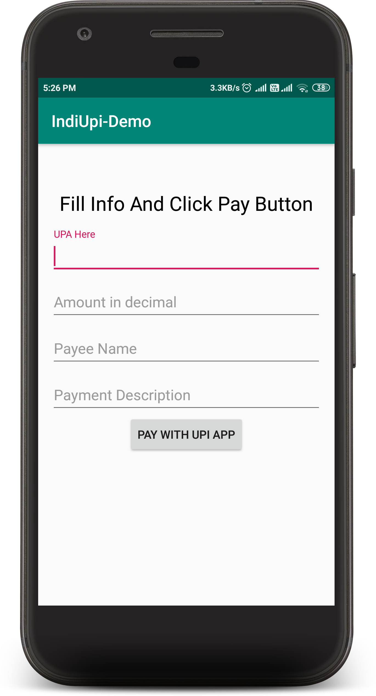
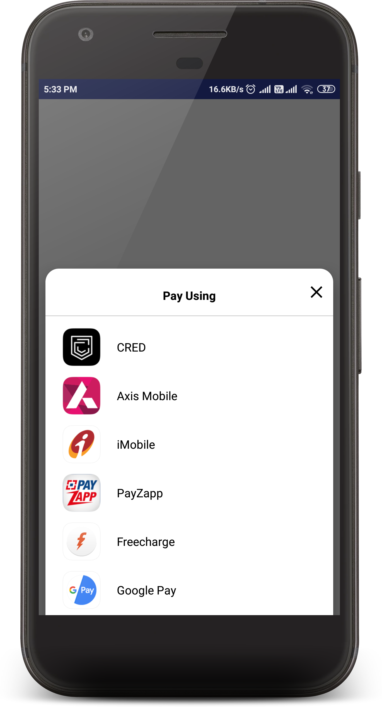
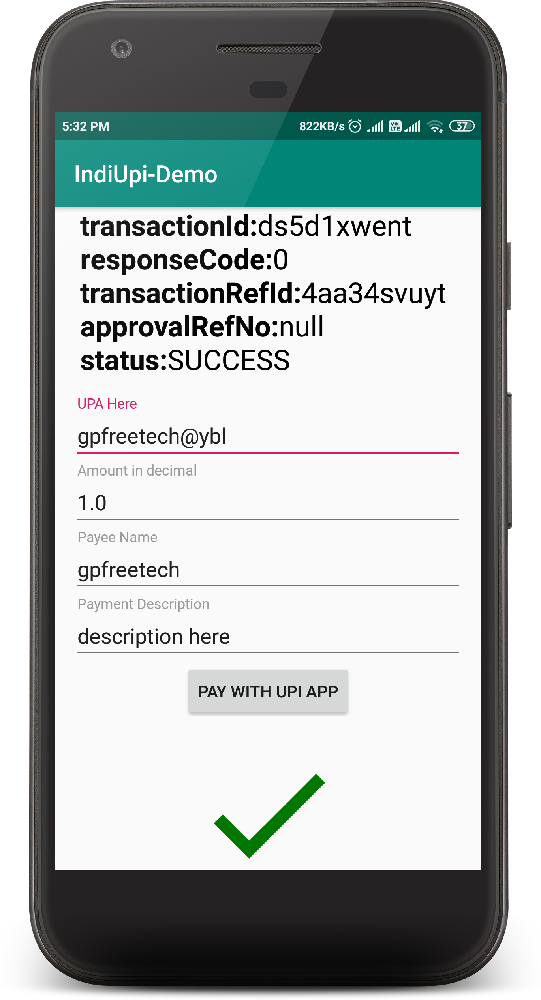

# IndiUPI Payment - Android Library 


Hello Guys, I have created and publish this Android library to easily implement UPI Payment Integration in Android app without any external SDK.
***Requirement for this library:*** UPI Deep-linking supported application are *required to be already installed in user mobile before using this library*. <br>


## How it Works
<table style="width:100%">
  <tr>
    <td></td>
    <td></td>
    <td></td>
  </tr>
  <tr>
    <th>1. Enter UPA, NAME, AMOUNT and Description</th>
    <th>2. Click on Pay and Select UPI App</th>
    <th>3. Response received in previous activity.</th>
  </tr>
</table>

## Implementation
You can clone this repository and import this project in Android Studio.

### Using Gradle
In your `build.gradle` file of app module, add below dependency to import this library

```gradle
    dependencies {
      implementation 'com.gpfreetech:IndiUpi:1.1'
    }
```

### In Your Working Activity
In Android app, Create activity and implement basic payment integration step where you want to add. In demo app I have already created `SampleActivity.java`

#### Initializing `IndiUpi` :
See below code, these are parameters to start payment processing.
```java
        IndiUpi indiUpi = new IndiUpi.Builder()
                .with(this)
                .setPayeeVpa("payee@upi")
                .setAmount("AMOUNT_IN_DECIMAL")
                .setPayeeName("payee name")
                .setDescription("DESCRIPTION")
                .setTransactionId("UNIQUE_TRANSACTION_ID")
                .setTransactionRefId("UNIQUE_TRANSACTION_REF_ID")
				.setUrl("HTTP_OR_HTTPS", "WWW.EXAMPLE.COM", "API.php")
				//internal parameter automatically add in URL same as above UPI request
                .build();
```
#### setUrl(...) is optional

**Parameter Details:**

<table>
<tbody>
<tr>
<th>Method</th>
<th><span style="&ldquo;font-weight: bold&rdquo;;">Mandatory</span></th>
<th>Description</th>
</tr>
<tr>
<td>with()</td>
<td>YES</td>
<td>Pass activity instance where Payment process is to be implemented</td>
</tr>
<tr>
<td>setPayeeVpa()</td>
<td>YES</td>
<td>here VPA address of payee for like <span style="&ldquo;font-weight: 600&rdquo;;">gpfreetech@upi</span></td>
</tr>
<tr>
<td>setTransactionId()</td>
<td>YES</td>
<td>This field is used in Merchant Payments generated by PSPs. This is Unique key. and for demo purpose we have already generae random id using method in Validator.java file. You can check this</td>
</tr>
<tr>
<td>setTransactionRefId()</td>
<td>YES</td>
<td>This is mandatory. Transaction reference ID. i.e. order number, subscription number, Bill ID, booking ID etc. this is very important for backend purpose and dynamic URL generation. You can validate your payemt using txnRefId</td>
</tr>
<tr>
<td>setDescription()</td>
<td>YES</td>
<td>To provide a description about payment. for e.g. <br /><span style="&ldquo;font-style: italic&rdquo;;">Home Rent</span></td>
</tr>
<tr>
<td>setAmount()</td>
<td>YES</td>
<td>It takes the amount in String decimal format (xx.xx)<br />For e.g. 05.10 will pay <span style="&ldquo;font-style: italic&rdquo;;">Rs. 05.11.</span></td>
</tr>
<tr>
<td>setPayeeMerchantCode()</td>
<td>No</td>
<td>Payee Merchant code if present it should be passed.</td>
</tr>
  <tr>
<td>setUrl()</td>
<td>No</td>
<td>Here you can enter your scheme, authority and appendPath. ex  .setUrl("http", "www.sample.com", "test.php")</td>
</tr>
<tr>
<td>build()</td>
<td>YES</td>
<td>
<p>It will build and returns the <span style="&ldquo;font-weight: bold; font-style: italic&rdquo;;">IndiUpi</span>single instance.</p>
</td>
</tr>
</tbody>
</table>

#### Start Payment
To start the payment, just call `pay()` method using current instance and after that transaction is started.
```java
      indiUpi.pay();
```
Or
```java
      indiUpi.pay("Payment Using"); // here your choice dialog title
```
#### Set Callback Listeners for response
To register for callback events, you will have to set `PaymentStatusListener` with instance as below.
```java
        indiUpi.setPaymentStatusListener(this);
```
**Description :**

* `onTransactionCompleted()` - This method is invoked when transaction is completed. It may either `SUCCESS`, `SUBMITTED` or `FAILED`.
> **NOTE - If onTransactionCompleted() is invoked it doesn't means that payment is successful. It may fail but transaction is completed is the only purpose.**
* `onTransactionSuccess()` - call when Payment is successful.
* `onTransactionSubmitted()` - call when Payment is partially done/In waiting/Submitted/Pending.
* `onTransactionFailed()` - call when Payment is unsuccessful/failed.
* `onTransactionCancelled()` - call when Payment cancelled (pressed back button or any reason).
```java
    @Override
    public void onTransactionCompleted(TransactionResponse transactionResponse) {
        // Transaction Completed
        Log.d("TransactionResponse", transactionResponse.toString());
		// normal
        txtStatus.setText(transactionResponse.toString());
		//or as HTML Text in format
		txtStatus.setText(Html.fromHtml(transactionResponse.toHTMLString()));
    }

    @Override
    public void onTransactionSuccess(TransactionResponse transactionResponse) {
        // Payment Success
        Toast.makeText(this, "Payment Success", Toast.LENGTH_SHORT).show();
        imageView.setImageResource(R.drawable.ic_success);
    }

    @Override
    public void onTransactionSubmitted() {
        // Payment Pending
        Toast.makeText(this, "Payment Pending Or Submitted", Toast.LENGTH_SHORT).show();
        imageView.setImageResource(R.drawable.ic_success);
    }

    @Override
    public void onTransactionFailed() {
        // Payment Failed
        Toast.makeText(this, "Payment Failed", Toast.LENGTH_SHORT).show();
        imageView.setImageResource(R.drawable.ic_failed);
    }

    @Override
    public void onTransactionCancelled() {
        // Payment Process Cancelled by User
        Toast.makeText(this, "Cancelled", Toast.LENGTH_SHORT).show();
        imageView.setImageResource(R.drawable.ic_failed);
    }
```

### Getting Transaction Response
To get transactions details, used `onTransactionCompleted()`. Which provice parameter of `TransactionResponse`. TransactionResponse instance includes details about completed transaction.  <br>
`TransactionResponse` contains below information :

<table>
  <tr>
    <th>Method</th>
    <th>Description</th>
  </tr>
  <tr>
    <td>getTransactionId()</td>
    <td>Returns Transaction ID</td>
  </tr>
  <tr>
    <td>getResponseCode()</td>
    <td>Returns UPI Response Code</td>
  </tr>
  <tr>
    <td>getApprovalRefNo()</td>
    <td>Returns UPI Approval Reference Number (beneficiary)</td>
  </tr>
  <tr>
    <td>getStatus()</td>
    <td>Returns Status of transaction.<br>(Submitted/Success/Failure)<br></td>
  </tr>
  <tr>
    <td>getTransactionRefId()</td>
    <td>Returns Transaction reference ID passed in input</td>
  </tr>
</table>

Note : BHIM supports UPI deep-linking but does not return the transaction reference number, instead returns the txnref with the value “undefined”
Same few UPI Deep-linking supported app does not return the transaction reference number.

Currently we are working on it, There are lot of improvements are still needed and in progress.
Like 
Url parameter handling
Minimum amount parameter handling

Suggestions are welcome.

## Contribute
If you have any issues or ideas about implementations then just raise issue and we are open for Pull Requests. You All Welcome.
